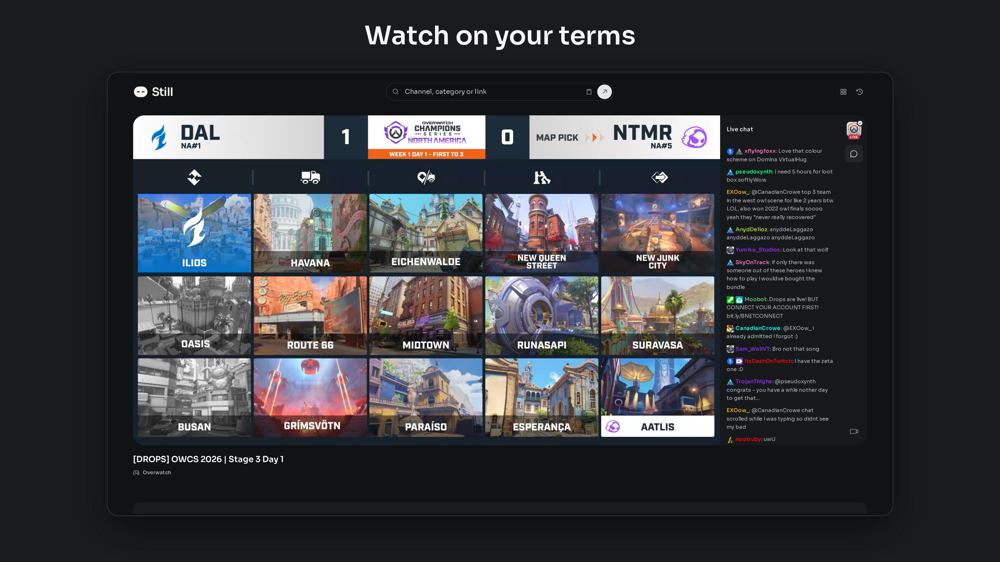
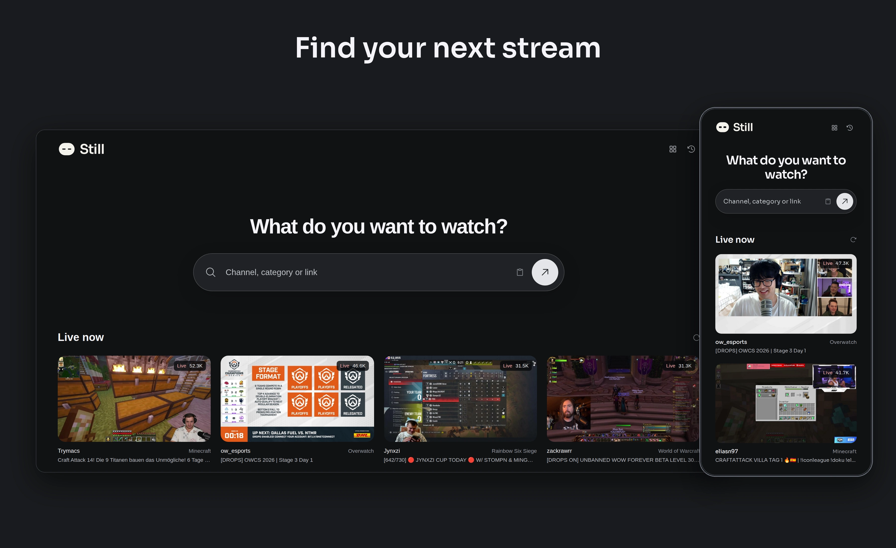
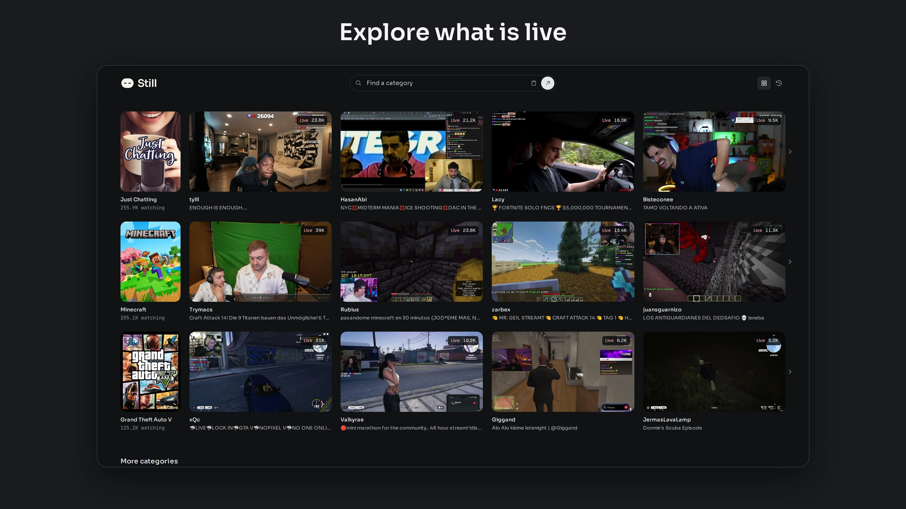

# Still

Still is a free, open-source, ad-free
Twitch player for live streams and VODs, part of Phantom Media. Search a channel or paste a Twitch
video or clip link; no account, extension, or installation is required.



## Features

- Ad-free live streams and VOD playback.
- Subscriber-only Twitch VODs when their source playlists are available, without a Twitch login.
- Live rewind and seeking through the current broadcast’s archive while the channel is still live, when an archive is available.
- Live playback returns to the live edge on resume and automatically recovers excess delay while protecting the playback buffer.
- Quality selection, playback speed, broadcaster captions, keyboard shortcuts and picture-in-picture.
- Native clip playback and continuous MP4 downloads; audio-only archive listening.
- Bounded TS/MP4 downloads with cancellation; growing archives export a captured window.
- Live chat and offset-based VOD replay with badges, colors and emotes.
- Official chapters, historical storyboard browsing and on-demand sampled chat search/reactions.
- A category directory: the most watched categories with their top streams, typo-tolerant category search, and a page per category listing who is live.
- Channel/category video and clip libraries, one bounded request per selected view.
- Browser-local history, resume positions, and playback preferences.
- No app analytics, tracking cookies, or Twitch account requirement.





Source media must still be available: Still cannot restore deleted
videos, and archive-based rewind depends on the channel and Twitch. Media and
chat use third-party services. Cloudflare observability is currently enabled
in the Worker configuration, and opt-in debug diagnostics exist, so account-free
viewing does not mean zero infrastructure logging or network anonymity.

## Development

UI uses `@phantom/theme/media.css`, `@phantom/theme/player.css`, and
`@phantom/ui`; the Twitch resolver, transport, and playback engine live here.

### Live latency

Live requests ask Twitch for its `fast_bread` feed. Progressive MSE players
consume up to two `EXT-X-TWITCH-PREFETCH` segments directly from Twitch as their
bytes arrive, without waiting for completion or routing video through the app.
The adapter retains sequence identity and timestamps, excludes ads and unsafe
tails, and falls back to completed segments if predictive delivery fails.
Native HLS keeps the completed-segment path. Encoder-paced prefetch is excluded
from throughput estimates and emergency ABR aborts within its encoding
allowance. Genuinely slow predictive transfers restore bandwidth sampling and
in-flight downswitching, so Automatic quality can recover when delivery slows.
Predictive playback follows the actual contiguous bytes with a 750ms burst
reserve, reducing it to 600ms after 30 seconds of healthy delivery, and gentle
catch-up up to 1.03×; it does not mistake advertised future media for a playable
buffer. Resume uses already encoded bytes with the conservative reserve,
falling back to the completed playlist edge when those bytes are unavailable.
Real stalls restore the conservative reserve and increase it automatically;
a brief 0.97× adjustment rebuilds
headroom after jitter without seeking backward. Once playing, catch-up follows
the actual buffer even when encoded bytes lead the last completed segment in
the playlist, so playlist reload cadence does not add avoidable delay.

Ordinary live playback starts in Automatic quality so ABR can react to measured
delivery speed. A single latency controller shares the connection monitor's
one-second sample; it adds no polling loop. A stale paused playlist refreshes
once on resume. Regular HLS
targets one and a half recently observed segments behind the estimated live edge
(at least two seconds), retaining one complete segment in the available window.
It uses the largest of the last three segments, since Twitch's advertised target
duration can be much larger than its actual segment cadence.
LL-HLS uses the server's part hold-back, with at least three parts of safety.
These are targets relative to available media, not guarantees of broadcaster-to-viewer delay.

Pausing and resuming seeks to the current safe live position, including native
HLS and resumes before metadata arrives. Small drift is recovered at up to 1.05×
with adequate contiguous buffer; large drift jumps only to an already buffered
position. Starvation adds bounded headroom, which decreases after sustained
healthy playback. Stale playlists, hidden tabs, seeks, and unstable connections
cannot trigger accelerated catch-up. A behind-live indicator offers a manual
jump when necessary. Growing archives and VODs keep their paused position and
never attach this controller.

Live manifests remain uncached, and the media route forwards `_HLS_msn`,
`_HLS_part`, and `_HLS_skip` for upstream blocking and delta reloads.

#### Results

Local 720p testing on `ow_esports` (2026-10-11):

- **Still:** 1.85–1.94 seconds of measured delay, with no rebuffering after startup.
- **Twitch:** 2.69–2.95 seconds reported earlier in the same session.
- **Validation:** 232 tests, typecheck, lint, and webpack production build passed.

From the workspace root:

```sh
pnpm install
pnpm --filter @phantom/still dev
```

The app runs on the default Next.js development port. See the root README for
workspace checks and design package boundaries.

Modules now follow their owners: upstream queries in `lib/twitch/`, resolution
in `lib/playback/`, and matching watch/player/chat/download/history/discovery
component directories. See [architecture](docs/architecture.md),
[implementation/validation record](docs/refactor.md), [upstream source policy](docs/source-policy.md) and
[fixture provenance](test/fixtures/research/README.md).

For a Cloudflare Worker deployment, build with the canonical URL and provide
the custom domain to Wrangler:

```sh
NEXT_PUBLIC_BASE_URL=https://your-host.example pnpm --filter @phantom/still exec opennextjs-cloudflare build
pnpm --filter @phantom/still exec wrangler deploy --domain your-host.example --domain www.your-host.example --var NEXT_PUBLIC_BASE_URL:https://your-host.example
```

Set `NEXT_PUBLIC_BASE_URL` to the canonical apex URL at build time. Its `www`
host permanently redirects to that origin while preserving paths and query
strings. When the variable is unset or blank, no host redirect is emitted.
Production hostnames are supplied through deployment settings.

The custom `worker.js` entry point streams `/api/proxy` media requests directly
through the Fetch API. All other requests use the generated OpenNext handler.
This keeps multi-megabyte video segments out of Next's Node response adapter;
the Next dev route shares the same proxy implementation. Server-rendered pages
and playlist resolution can exceed Workers Free's 10 ms CPU budget, so a free
account can still return Cloudflare error 1102 even with this media fast path.

Cloudflare Builds deploys this Worker from the `deploy/twitch` branch with
`/apps/still` as its root. That branch only moves to a `@phantom/still@<version>`
release, which is tagged once the commit has passed CI and built as a preview,
so pushes to `main` do not reach production.
The app directory is `apps/still`. Cloudflare Builds must use `/apps/still` as
its build root and watch `apps/still/**` alongside shared packages and workspace
dependency files. Update those external settings when migrating from the old
app directory. The release script maps Still to the existing `deploy/twitch`
branch and `phantom-twitch` Worker. The package and new release tags are
`@phantom/still`; historical Twitch tags remain unchanged.
See [brand and compatibility](docs/brand.md).
The build installs the workspace dependencies and runs OpenNext; Wrangler then
deploys to both custom domains. Cloudflare Builds must build `main` as a
non-production preview and deploy production from `deploy/twitch` so the release
workflow can verify the preview before promotion. These are required settings;
the remote configuration has not been inspected. The Worker watches this app, shared packages, and workspace dependency
files, so changes confined to other apps do not rebuild it.

Playback opens with chat visible. Hide or show chat in the player controls or
the channel controls. On narrow screens, chat appears
below the video details. VODs offer synchronized replay and the channel's live
chat as separate sources. Replay follows pauses and seeks, fetches overlapping
timestamp windows on demand, and deduplicates messages by ID. Live chat uses a
read-only Twitch IRC connection with reconnect and keepalive handling; it does
not send chat messages. Chat availability depends on the source video/channel.

Catalogs and replay expose partial coverage: Twitch cursors are unavailable, so a
view is one page reached by sort, type, period or language, and crowded replay seconds can contain gaps.
Muted windows use silent fallback; no missing-audio recovery is claimed.
Video adaptation excludes audio renditions; audio-only listening uses its own media
playlist. Audio downloads retain the actual TS container; MP3/M4A conversion and ASR are
not included. Blob-only browsers are limited to 256 MB per download; direct file
saving supports larger transfers.

Use the category icon in the header for [category browsing](/categories).
PubSub, animated hover previews, activity lights and unpinned operation
families remain outside this release.
